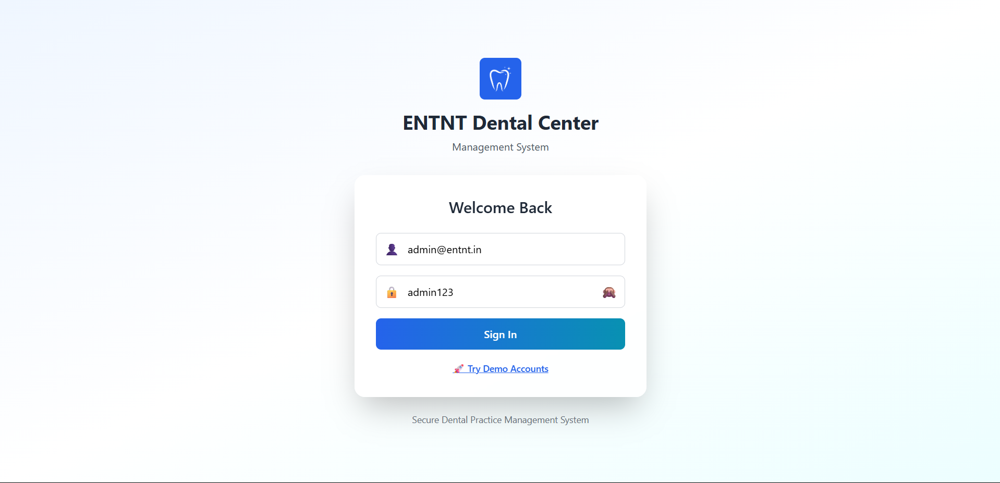
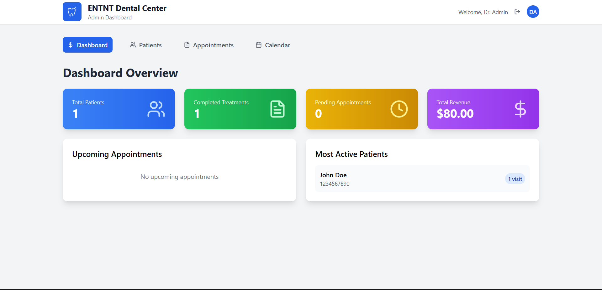
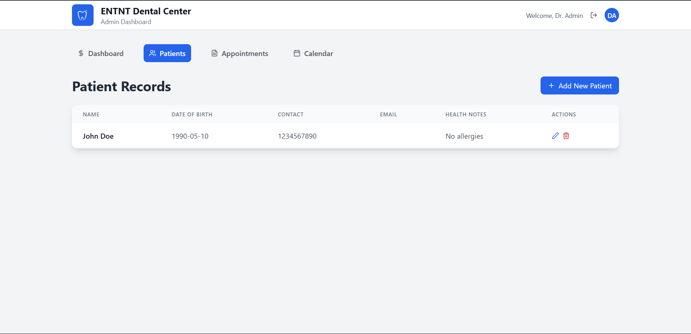
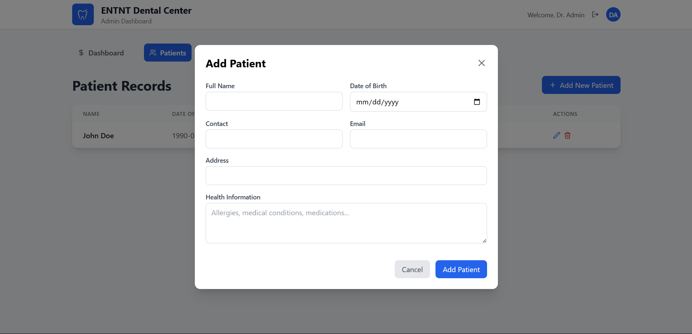
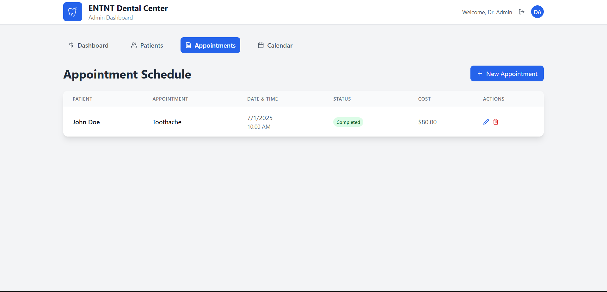
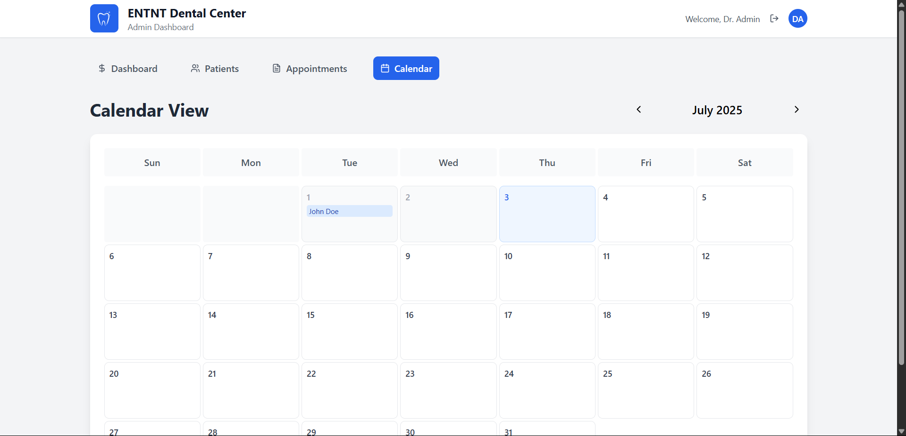
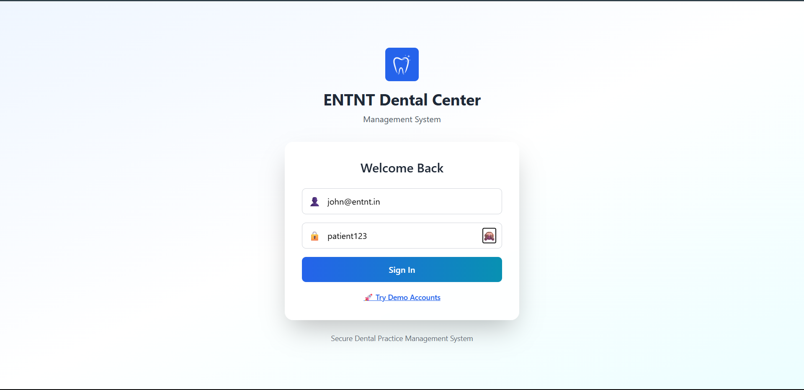
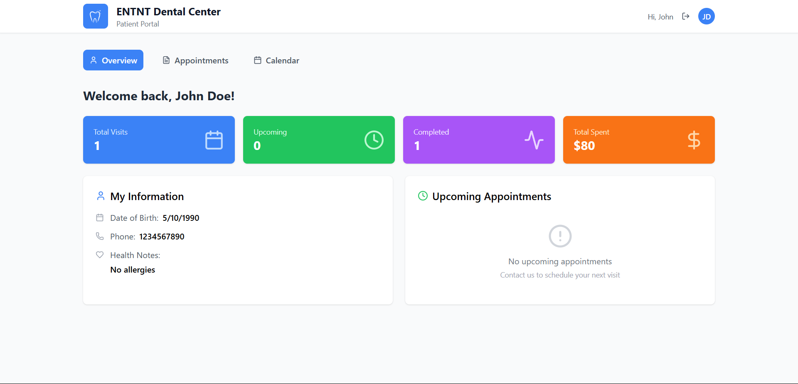
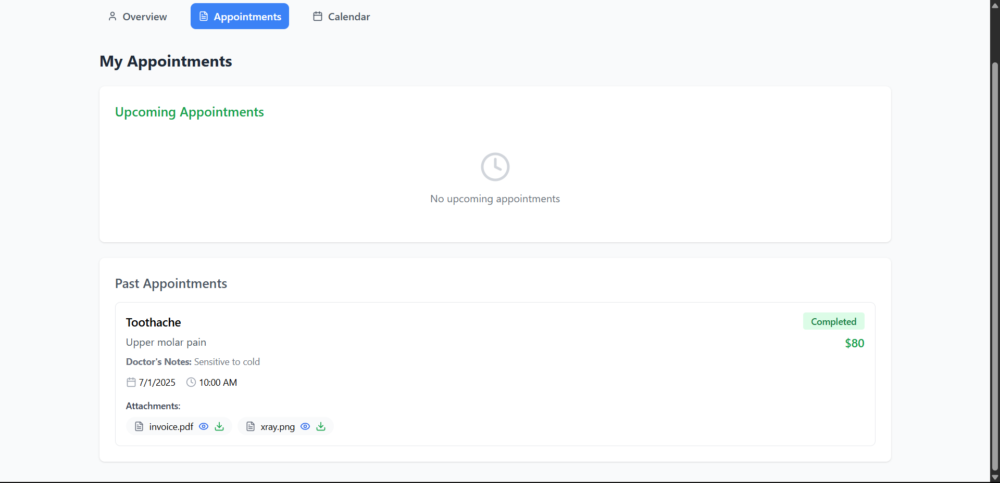
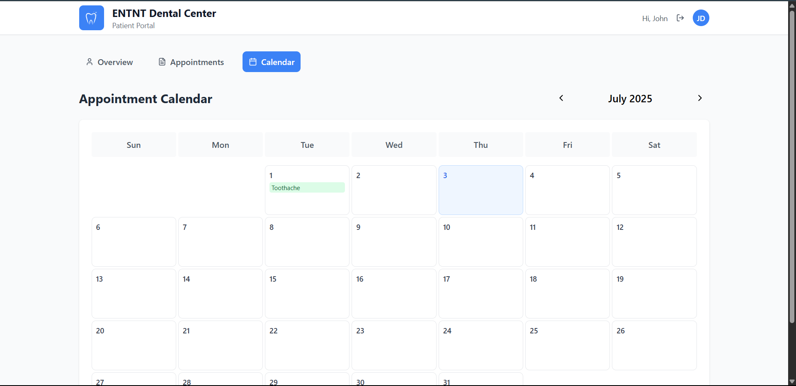

# 🦷 ENTNT Dental Center - Frontend Assignment

A responsive, frontend-only Dental Center Management System built with React. This project fulfills the requirements of the ENTNT Technical Assignment and includes Admin and Patient portals with full functionality and modern UI/UX.

> ✅ **Live on Vercel:** [https://entnt-dental-center-eta.vercel.app](https://entnt-dental-center-eta.vercel.app)

---

## 🚀 Quick Start

### 📋 Prerequisites

- Node.js (v14 or higher)
- npm or yarn

### ⚙️ Installation

```bash
# 1. Clone the repository
git clone https://github.com/rupeshrb/Entnt-Dental-Center.git

# 2. Navigate into the project directory
cd Entnt-Dental-Center

# 3. Install dependencies
npm install
# or
yarn install

# 4. Start the development server
npm start
# or
yarn start
```
🔐 Demo Credentials
👨‍⚕️ Admin Login
Email: admin@entnt.in

Password: admin123

👤 Patient Login
Email: john@entnt.in

Password: patient123

🧠 Features
🔒 Authentication & Access Control
-Role-based (Admin & Patient)
-Simulated login using localStorage
-Protected routes with context-based auth

👥 Admin Portal
-Patient CRUD (Add/Edit/Delete)
-Appointment lifecycle management
-Calendar integration
-Revenue & KPI dashboard
-File uploads (base64) with preview

🧾 Patient Portal
-View personal profile
-See upcoming & past appointments
-Download attached files
-Fully responsive UI

🛠 Architecture
📦 Tech Stack
-Tool	Purpose
-React 18	Frontend Framework
-React Router	Navigation
-Context API	Global state management
-Tailwind CSS	Responsive utility-first styling
-Lucide React	Icon library
-localStorage	Data persistence (no backend)

🗂 Folder Structure
<br>public/
<br>  └── assets/
<br>src/
<br>  ├── components/
<br>  ├── context/
<br>  ├── data/
<br>  ├── pages/
<br>  ├── App.js
<br>  └── index.css
<br>tailwind.config.js
<br>package.json

❗ Known Issues
-No actual backend or API (by design of assignment)
-Authentication is simulated (no real user verification)
-No form-level validation libraries used
-Large component files could be refactored into smaller ones

💡 Technical Decisions
-Context API was used over Redux for simpler state sharing between auth and UI
-localStorage was used for persisting patient/appointment/file data
-Base64 encoding was chosen for handling file uploads in a frontend-only environment
-Calendar view was built using native JS Date instead of external libraries
-Tailwind CSS helped achieve fast, responsive, and mobile-first UI development

<br>
Output :-
<br>
<div>
  
  
  
  
  
  
  

  
  
  

  
  
</div>
